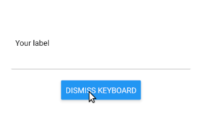

[](https://circleci.com/gh/AlejandroFabianCampos/react-native-awesome-text-input)
[](https://codecov.io/gh/AlejandroFabianCampos/react-native-awesome-text-input)

# react-native-awesome-text-input
A simple lib to share an easy to implement animated custom text input for React native



## How to install 
With npm:
`npm i react-native-awesome-text-input`

With yarn: 
`yarn install react-native-awesome-text-input`

## To implement it is as easy as to import it and use it like a common React native's text input:

```javascript
import { AwesomeTextInput } from 'react-native-awesome-text-input';

export default function App() {
  return (
    <AwesomeTextInput label="Label test" />
  );
}
```
| Prop | Values | Example |
| ---- | -------- | ---- |
| label | string | Example label |
| customStyles | { <br> container?: ReactNative.ViewStyle, <br> title?: ReactNative.TextStyle, <br> inputContainer?: ReactNative.ViewStyle <br> } | { <br> container: { borderRadius: 5, backgroundColor: 'purple' } , <br> title: { color: "white" }, <br> inputContainer: { backgroundColor: 'blue' } <br> } |
| ...any ReactNative.TextInput props | [ReactNative.TextInput props](https://reactnative.dev/docs/textinput#props) | secureTextEntry: true <br><br> // Hide the text input for passwords |


### Are pull requests and feature requests welcomed? 
For sure! Don't hesitate to open issues with the `enhancement` tag or open pull requests for bugfixes/enhancements.
